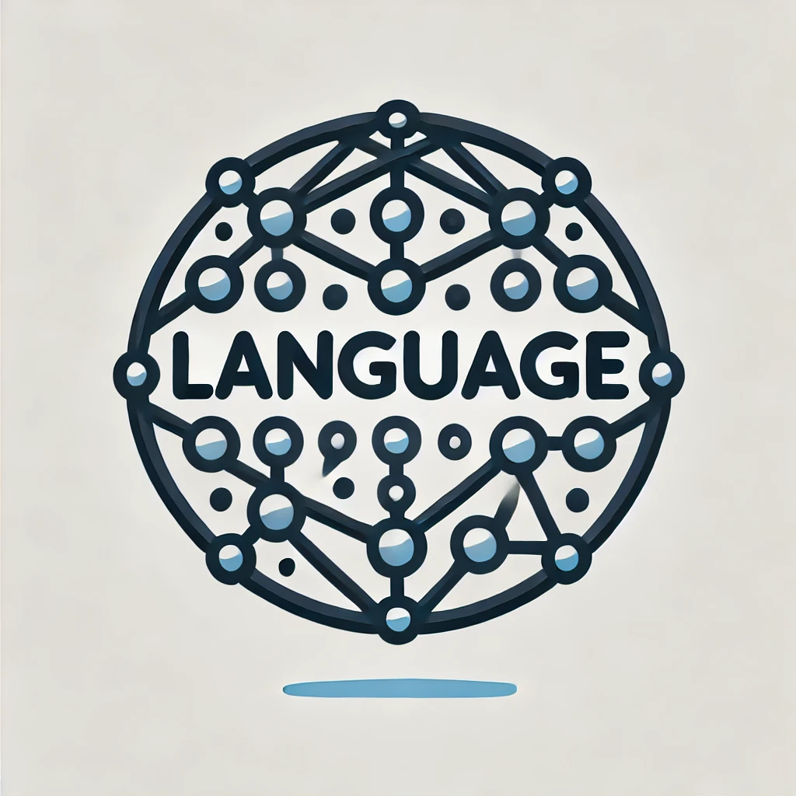

# LangGFM: A Large Language Model Alone Can be a Powerful Graph Foundation Model

  
<!--  -->

 

<!-- 
# LangGFM
Official code of "A Large Language Model Alone Can be a Powerful Graph Foundation Model" -->

<!-- --- -->

Environment
---
For pip (with python 3.11): `requirements.txt`   
`pip install -r requirements.txt`

For conda `environment.yml`  
`conda env create -f environment.yml`

run commands in `LangGFM/`

To ensure compatibility with all graphs in the open world, treat all graphs as MultiDiGraph: 
* A directed graph class that can store multiedges. 
* Multiedges are multiple edges between two nodes. Each edge can hold optional data or attributes.
* A MultiDiGraph holds directed edges. Self loops are allowed.

In an undirected graph, edges have no direction. An undirected edge can be represented as two directed edges in opposite directions. 

